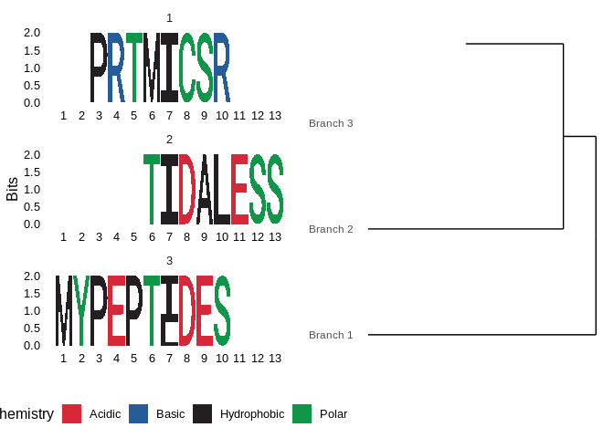

<!-- README.md is generated from README.Rmd. Please edit that file -->
ggseqmsa
========

The goal of ggseqmsa is to cluster and do cool plots on

Example
-------

This is a basic example which shows you how to solve a common problem:

``` r
require(ggseqmsa)
#> Loading required package: ggseqmsa

fakeseqences_char <- c('PEPTIDES','MYPEPTID','MYPEPTLD',
                       'TIDALESS','PRTMICSR')

fakesequences_aastrng <- Biostrings::AAStringSet(
    c('PEPTIDES','MYPEPTID','MYPEPTLD',
      'TIDALESS','PRTMICSR'))

fakeseqences_file <- tempfile()
Biostrings::writeXStringSet(fakesequences_aastrng, fakeseqences_file)

g <- draw.msa.dendrogam(fakeseqences_char, cutoff = 0.5)
#> Generated temp fasta in /tmp/RtmpjpRaNL/file3181d3896ab
#> Clustal run finished, 
#> Distance matrix stored in /tmp/RtmpjpRaNL/file3181988b7cc
#> Output fasta locatd in /tmp/RtmpjpRaNL/file31856ba1ec9
#> Warning in bits_method(seqs, decreasing = rev_stack_order, seq_type =
#> seq_type, : All positions have zero information content perhaps due to too
#> few input sequences. Setting all information content to 2.

#> Warning in bits_method(seqs, decreasing = rev_stack_order, seq_type =
#> seq_type, : All positions have zero information content perhaps due to too
#> few input sequences. Setting all information content to 2.

#> Warning in bits_method(seqs, decreasing = rev_stack_order, seq_type =
#> seq_type, : All positions have zero information content perhaps due to too
#> few input sequences. Setting all information content to 2.
# g<-draw.msa.dendrogam(fakesequences_aastrng, cutoff = 0.5)
# g<-draw.msa.dendrogam(fakeseqences_file, cutoff = 0.5)

print(g)
```


